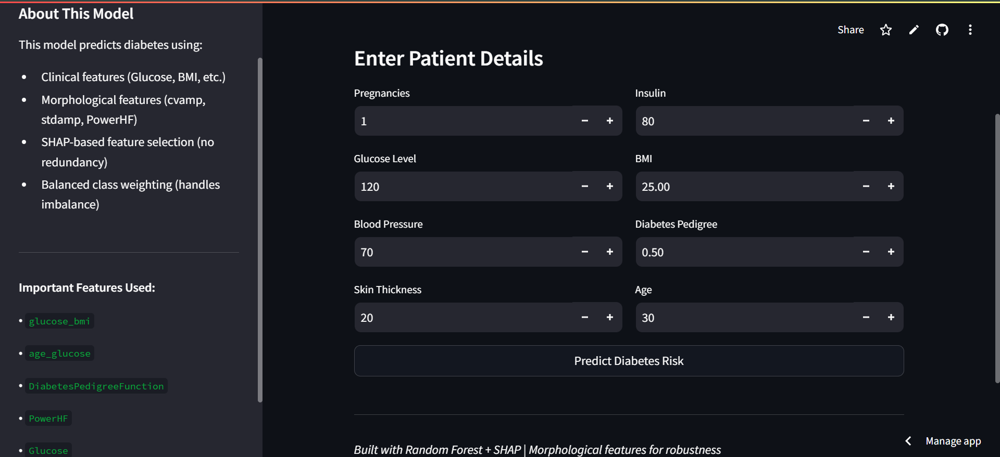

# 🩺 Diabetes Prediction Web App


> **A smart diabetes risk predictor that explains WHY it made each decision — not just what it predicted.**

---

## 🔗 Live App
👉 **[Click here to try the app](https://diabetes-prediction-webapp-v2.streamlit.app/)**

---

##  App Preview



---

##  Overview

This project goes beyond simple glucose-based prediction. It uses a full ML pipeline with multiple models, automatic best-model selection, morphological signal features, and explainable AI — making it robust, efficient, and transparent.

**What makes this model better:**

| Technique | Why It Helps |
|---|---|
| **Multiple Models Tested** | XGBoost, Random Forest, Gradient Boosting all compared |
| **Auto Best-Model Selection** | Best model picked automatically — no guessing |
| **10-Fold Cross Validation** | Model tested 10 times on different data splits for reliability |
| **Morphological Features** | Signal pattern features added for better generalization across different people |
| **SHAP Analysis** | Removes redundant features — keeps only what truly matters |
| **SMOTE** | Fixes imbalanced data so model learns both diabetic and non-diabetic equally |
| **Regularization** | Prevents overfitting — model generalizes well on new patients |

---

##  How It Works

```
1. Enter patient details
        ↓
2. Morphological features computed automatically
        ↓
3. SHAP selects only the most important features
        ↓
4. Best model (XGBoost) makes prediction
        ↓
5. Result + Risk % + SHAP explanation chart shown
```

---

## Model Performance

| Metric | Value |
|---|---|
| Dataset | Pima Indians Diabetes (768 samples) |
| Best Model | XGBoost (auto-selected) |
| Accuracy | ~76% |
| Diabetic Recall | 70% |
| Validation | 10-Fold Stratified Cross Validation |
| Imbalance Fix | SMOTE |


---

## 📁 Features Used

| Feature | Type |
|---|---|
| Glucose, BMI, Age, Pregnancies | Clinical |
| DiabetesPedigreeFunction | Clinical |
| BloodPressure, Insulin, SkinThickness | Clinical |
| cvamp, stdamp, PowerHF |  Morphological |
| age_glucose, glucose_bmi, insulin_bmi |  Morphological |

> SHAP automatically selects the most impactful features from the above before final training.

---

##  SHAP Explainability

After every prediction a bar chart shows:
- 🔴 **Red bars** → features pushing toward Diabetic
- 🟢 **Green bars** → features pushing toward Not Diabetic

---

## How to Run Locally

```bash
# 1. Clone the repo
git clone https://github.com/adhora7/Diabetes-Prediction-Webapp-V2.git
cd Diabetes-Prediction-Webapp-V2

# 2. Install dependencies
pip install -r requirements.txt

# 3. Train the model first
python train_model.py

# 4. Launch the app
streamlit run app.py
```

> Built using **PyCharm** with Python virtual environment (venv)

---

##📁 Project Structure

```
📁 Diabetes-Prediction-Webapp-V2
 ├── 📁 .idea/                → PyCharm project settings
 ├── 📁 .streamlit/
 │   └── config.toml          → Streamlit server config
 ├── 📄 .gitattributes        → Git config
 ├── 📄 .python-version       → Python version file
 ├── 📄 LICENSE               → MIT License
 ├── 📄 README.md             → Project documentation
 ├── 📄 app.py                → Streamlit web app
 ├── 📄 app_view.png          → App screenshot
 ├── 📄 diabetes.csv          → Dataset
 ├── 📄 features.pkl          → SHAP-selected features
 ├── 📄 model.pkl             → Saved best model
 ├── 📄 requirements.txt      → Dependencies
 ├── 📄 runtime.txt           → Python version (3.11)
 ├── 📄 scaler.pkl            → Saved scaler
 └── 📄 train_model.py        → Training + SHAP + model selection
```

---

## Tech Stack

Python · PyCharm · Streamlit · XGBoost · SHAP · Scikit-learn · SMOTE · Matplotlib

---

##  Author

**Faria Anowara Adhora** — 

[](https://www.linkedin.com/in/faria-anowara-adhora?utm_source=share_via&utm_content=profile&utm_medium=member_android)
[](https://github.com/adhora7)

---
*v2.0 · Built with PyCharm · Deployed on Streamlit Cloud*

